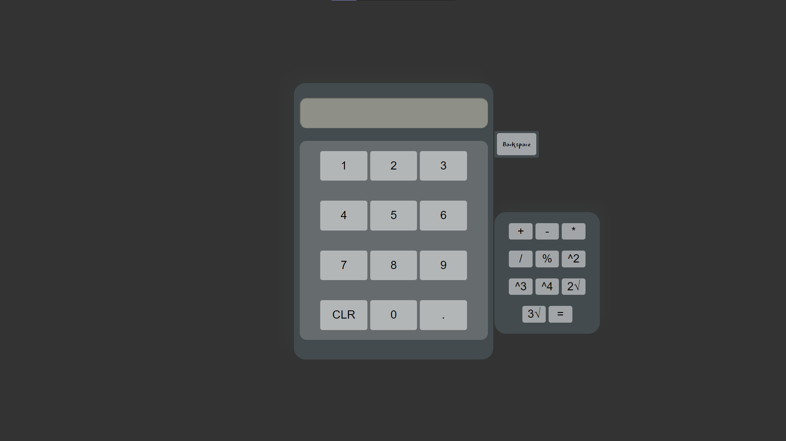
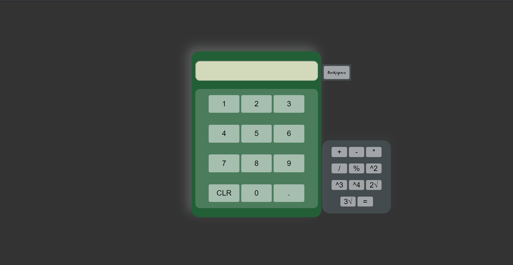
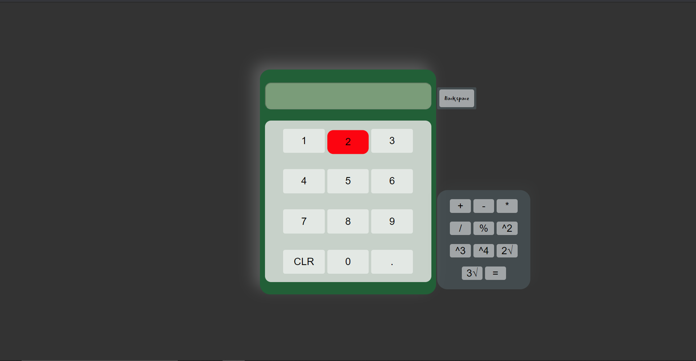

# Calculator-for-Web
A small calculator app for website made with just HTML, CSS and a little bit of Javascript
# Link : 
https://drive.google.com/drive/folders/18qzUqIj_DqYCXdpaLLI67G_BEXBddass?usp=sharing

* Link contains the project.
* Video preview of the game.

# Screenshot : 

# Aim
* To implement a calculator which is visually attractive and working flawlessly.

# System Requirements
* Windows 10 pro
* Visual Studios Code
* Node.js
* Chrome Web Browser recommended

# Getting Started
* Start by downloading the project from given link at the bottom.
* Add this project to a folder in your drive 
* Open that folder with visual studios code or any notepad.
* Keep all files togather.
